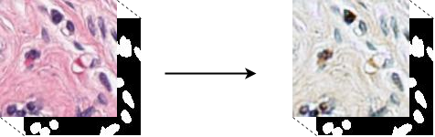
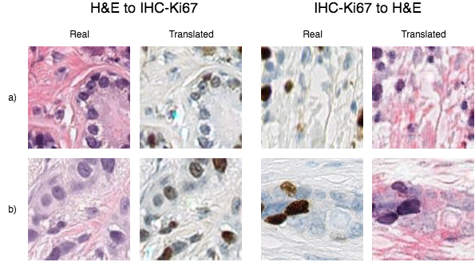

# Image to image translation of Whole Slide (WSI) Images using CycleGAN

This repository contains my bachelor thesis about [CycleGAN](https://arxiv.org/pdf/1703.10593.pdf) where I transformed WSI stained with Hematoxylin&Eosin and WSI stained IHC-KI67 back and forth between domains. 
This was done in an attempt to create a methological data augmentation pipeline, which in theory could be used to augment datasets.
 When translating images from one domain to another it then becomes possible to expand the size of the dataset with the images from the other domain. This in turn will create more robust models.

To test the generated data I've created a website [joachimes.dk](www.joachimes.dk) where a survey presents the user with 4 images. 3 of the images are real images from the dataset and the last one is an artificially translated image from the opposite domain.

Data provided by [Visiopharm](https://visiopharm.com) and Department of Computer Science at University of Warwick.

Made with inpiration from [junyanz](https://github.com/junyanz/pytorch-CycleGAN-and-pix2pix) and [eriklindernoren](https://github.com/eriklindernoren/PyTorch-GAN/)

## Project Structure
A walkthrough the project's structure is often a good idea, to let developers know the design patterns and directory structure in use so they know where to find and add things.
* cycleGAN folder contains the cycleGAN model and the training model.
* pipeline folder contains the pipeline used to generate the training and test data from WSI.
* dataExploration.ipynb is a visualizing notebook to grasp the data
* panNukeExploration.ipynb is also a data exploration notebook.
